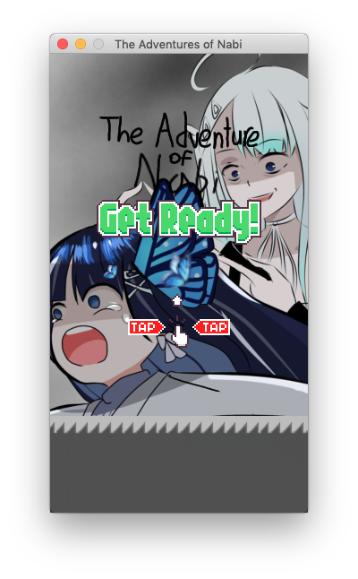

The Adventure of Nabi
===============

Original code : [Github](https://github.com/sourabhv/FlapPyBird)<br>
이 게임은 아오이 나비([Youtube](https://www.youtube.com/channel/UCzKkwB84Y0ql0EvyOWRSkEw), [Twitch](https://www.twitch.tv/nabinya))를 위한 팬게임입니다.<br>
라이선스는 MIT 라이선스지만 이는 **코드 한정** 으로 적용됩니다.<br>
사용된 일러스트는 [이곳](https://twitter.com/kakasiy2/status/1414476753922183172?s=20) 에서 확인할 수 있으며 개발을 위한 [허가](https://twitter.com/ajb_3296/status/1414970207576018944?s=20) 는 받았습니다.


How-to (as tested on MacOS)
---------------------------

1. Install Python 3.x (recommended) 2.x from [here](https://www.python.org/download/releases/)

1. Install [pipenv]

1. Install PyGame 1.9.x from [here](http://www.pygame.org/download.shtml)

1. Clone the repository:

   ```bash
   $ git clone https://github.com/ajb3296/The_Adventure_of_Nabi
   ```

   or download as zip and extract.

1. In the root directory run

   ```bash
   $ pipenv install
   $ pipenv run python3 nabi.py
   ```

1. Use <kbd>&uarr;</kbd> or <kbd>Space</kbd> key to play and <kbd>Esc</kbd> to close the game.

(For x64 windows, get exe [here](http://www.lfd.uci.edu/~gohlke/pythonlibs/#pygame))

Made something awesome from FlapPyBird? Add it to the list :)


ScreenShot
----------



[pygame]: http://www.pygame.org
[pipenv]: https://pipenv.readthedocs.io/en/latest/
